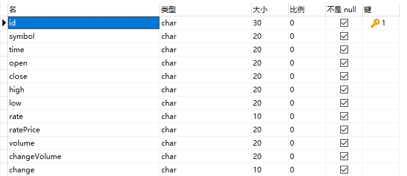
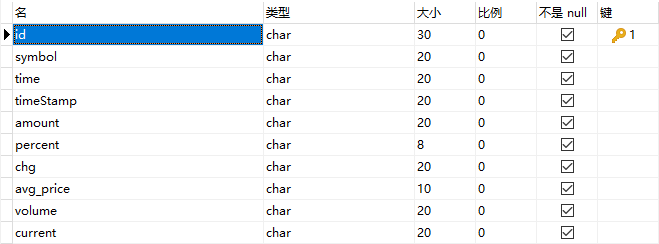
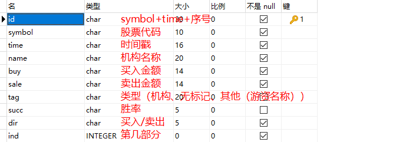
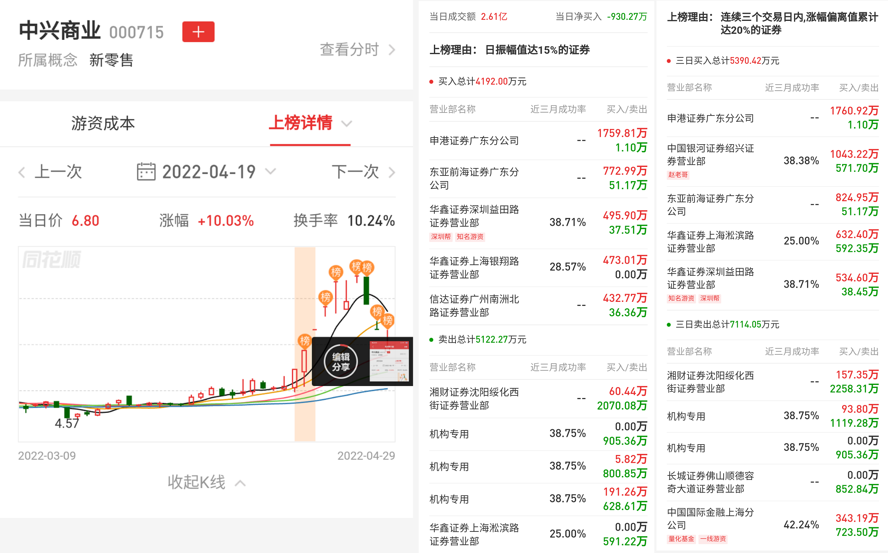

# stork_data

- 数据太多放在了 [阿里云盘](「dbs」https://www.aliyundrive.com/s/nxbMF7tzRk4)

### 日K ```雪盈```

[日K数据库](./db/stork.db)

- DBFile(stork) => Table(KRecord)



### 分时 ```雪盈```

[分时数据库(48个文件)](./db/fs)



### 游资 ```龙虎榜``` ```同花顺```

[游资数据库](./db/storkYZ.db)

- ind 是第几个索引，因为在请求中，包含了上部分和下部分，分别为 日换手率达 20% 的证券 和 连续三个交易日内，跌幅偏离值累计达 20% 的证券



下面的第二列 ind 为 0 ，第三列 ind 为 1，二三列上部分 dir 为 买入 ，下部分为 卖出，并且不管是买入卖出都有对应的买入卖出数据

例如 东亚前海证券广东分公司的数据如下

| id                       | symbol | time(时间戳)  | name    | buy     | sale   | tag  | succ | dir | ind |
|--------------------------|--------|------------|---------|---------|--------|------|------|-----|-----|
|000715-1650297600-0-sale-1 |000715|1650297600|中国国际金融股份有限公司上海分公司|3431860|7234980| 量化基金 |42.24|sale|1|
|000715-1650297600-1-sale-1 |000715|1650297600|长城证券股份有限公司佛山顺德容奇大道证|0|8528400| -    |--|sale|1|
|000715-1650297600-2-sale-1 |000715|1650297600|机构专用|0|9053560| 机构专用 |38.75|sale|1|
|000715-1650297600-3-sale-1 |000715|1650297600|机构专用|937997|11192800| 机构专用 |38.75|sale|1|
|000715-1650297600-4-sale-1 |000715|1650297600|湘财证券股份有限公司沈阳绥化西街证券营|1573510|22583100| -    | --    |sale|1|
|000715-1650297600-5-buy-1 |000715|1650297600|华鑫证券有限责任公司深圳益田路证券营业部|5346000|384479| 深圳帮  |38.71|buy|1|
|000715-1650297600-6-buy-1 |000715|1650297600|华鑫证券有限责任公司上海淞滨路证券营业部|6323990|5923470| -    | 25    |buy|1|
|000715-1650297600-7-buy-1 |000715|1650297600|东亚前海证券有限责任公司广东分公司|8249520|511724| -    | --    |buy|1|
|000715-1650297600-8-buy-1 |000715|1650297600|中国银河证券股份有限公司绍兴证券营业部|10432200|5717020| 赵老哥  |38.38|buy|1|
|000715-1650297600-9-buy-1 |000715|1650297600|申港证券股份有限公司广东分公司|17609200|11020| -    | --    |buy|1|
|000715-1650297600-10-sale-0 |000715|1650297600|华鑫证券有限责任公司上海淞滨路证券营业部|0|5912240| -    | 25   |sale|0|
|000715-1650297600-11-sale-0 |000715|1650297600|机构专用|1912620|6286090| 机构专用 |38.75|sale|0|
|000715-1650297600-12-sale-0 |000715|1650297600|机构专用|58242|8008480| 机构专用 |38.75|sale|0|
|000715-1650297600-13-sale-0 |000715|1650297600|机构专用|0|9053560| 机构专用 |38.75|sale|0|
|000715-1650297600-14-sale-0 |000715|1650297600|湘财证券股份有限公司沈阳绥化西街证券营|604350|20700800| -    | --    |sale|0|
|000715-1650297600-15-buy-0 |000715|1650297600|信达证券股份有限公司广州南洲北路证券营|4327700|363634| -    | --    |buy|0|
|000715-1650297600-16-buy-0 |000715|1650297600|华鑫证券有限责任公司上海银翔路证券营业部|4730080|0| -    | 28.57 |buy|0|
|000715-1650297600-17-buy-0 |000715|1650297600|华鑫证券有限责任公司深圳益田路证券营业部|4959040|375112| 知名游资 |38.71|buy|0|
|000715-1650297600-18-buy-0 |000715|1650297600|东亚前海证券有限责任公司广东分公司|7729930|511724| -    | --   |buy|0|
|000715-1650297600-19-buy-0 |000715|1650297600|申港证券股份有限公司广东分公司|17598100|11020| -    | --   |buy|0|



## 数据更新

- 更新 ```龙虎榜``` 数据

```cmd
:: 启动数据库服务
simpledb.exe --config=storkYZ.json --mode=web
node 龙虎榜数据.js
```

- 更新 ```日k```

```cmd
:: 启动服务 
simpledb.exe --config=stork.json --mode=web
node 抓取所有股票日 k
```

- 更新 ```分时```

```cmd
node getStorkData.js
node insertAllStorkFSData2db.js
storkSql/merge.bat
```
