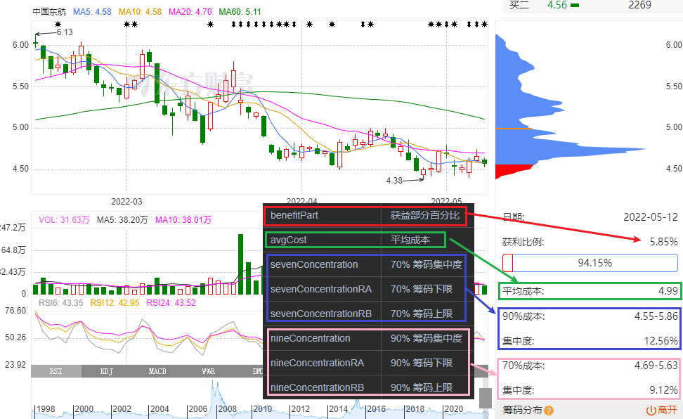
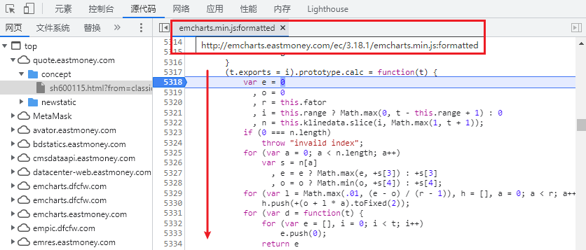
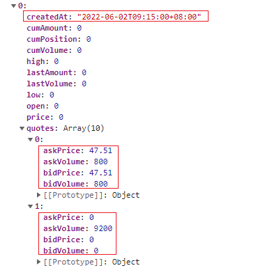
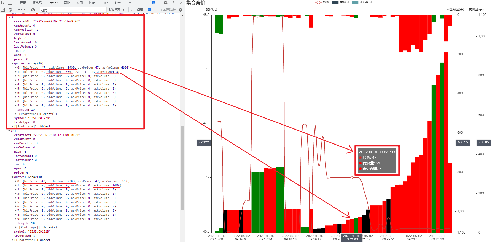

# stork_data

- 数据太多放在了 [阿里云盘](https://www.aliyundrive.com/s/nxbMF7tzRk4)

[simpledb.exe](https://gitee.com/IBAS0742/shareCode/blob/master/golang/SimpleDb/readme.md)

### 日K ```东方财富```

[日K数据库](./db/stork.db)

```后续只更新东方财富的数据，因为他比较容易爬取```

- ```kRecord``` 和 ```dfcfkRecord``` 分别为 ```同花顺``` 和 ```东方财富``` 的 ```日K``` 记录

| 标识符          | 说明                        | 类型     |
|--------------|---------------------------|--------|
| id           | id                        | string |
| symbol       | 股票代码                      | string |
| time         | 交易日期(时间戳)                 | bigint |
| open         | 开盘价                       | FLOAT  |
| close        | 收盘价                       | FLOAT  |
| high         | 高位                        | FLOAT  |
| low          | 地位                        | FLOAT  |
| rate         | 涨跌幅(%)                    | FLOAT  |
| ratePrice    | 涨跌额                       | FLOAT  |
| volume       | 成交量(手)                    | bigint |
| changeVolume | 成交额(手*价)                  | FLOAT  |
| change       | 换手率                       | FLOAT  |
| deta         | 振幅(一天中最高和最低的变化幅度，仅东方财富才有) | FLOAT  |

```sql
CREATE TABLE dfcfRecord (
  "id" char(30) NOT NULL,
  "symbol" char(20) NOT NULL,
  "time" bigint NOT NULL,
  "open" FLOAT NOT NULL,
  "close" FLOAT NOT NULL,
  "high" FLOAT NOT NULL,
  "low" FLOAT NOT NULL,
  "rate" FLOAT NOT NULL,
  "ratePrice" FLOAT NOT NULL,
  "volume" bigint NOT NULL,
  "changeVolume" FLAOT NOT NULL,
  "change" FLOAT NOT NULL,
  "deta" FLOAT NOT NULL,
  PRIMARY KEY ("id")
);
```

- DBFile(stork) => Table(KRecord)


### 分时 ```雪盈```

| 标识符       | 说明                        | 类型     |
|-----------|---------------------------|--------|
| id        | id                        | string |
| symbol    | 股票代码                      | string |
| time      | 交易日期(时间戳)                 | bigint |
| timeStamp | 时间戳(9:30~11:30、1:00~3:00) | bigint |
| amount    | 总成交量                      | bigint |
| percent   | 涨跌百分比                     | float  |
| chg       | 相对于(0%)变化价格               | float  |
| avg_price | 平均价格                      | float  |
| volume    | 成交量                       | bigint |
| current   | 当前价格                      | float  |

```sql
CREATE TABLE "main"."Untitled" (
  "id" char(30) NOT NULL,
  "symbol" char(20) NOT NULL,
  "time" bigint NOT NULL,
  "timeStamp" bigint NOT NULL,
  "amount" bigint NOT NULL,
  "percent" float NOT NULL,
  "chg" float NOT NULL,
  "avg_price" float NOT NULL,
  "volume" bigint NOT NULL,
  "current" float NOT NULL,
  PRIMARY KEY ("id")
);
```

[分时数据库(48个文件)](./db/fs)


### 游资 ```龙虎榜``` ```同花顺```

| 标识符          | 说明        | 类型       |
|--------------|-----------|----------|
| id           | id        | string   |
| symbol       | 股票代码      | string   |
| time         | 交易日期(时间戳) | bigint   |
| name         | 游资或机构名称   | char(20) |
| buy          | 买入量       | bigint   |
| sale         | 卖出量       | bigint   |
| tag          | 类型        | char(20) |
| succ         | 胜率        | float    |
| dir          | 买入 or 卖出  | char(5)  |
| ind          | 第几部分      | tinyint  |

```sql
create table if not exists recordYZRow (
  "id" char(30) NOT NULL,
  "symbol" char(10) NOT NULL,
  "time" bigint NOT NULL,
  "name" char(20) NOT NULL,
  "buy" bigint NOT NULL,
  "sale" bigint NOT NULL,
  "tag" char(20),
  "succ" float,
  "dir" char(5) NOT NULL,
  "ind" tinyint NOT NULL,
  PRIMARY KEY ("id")
);
```

[游资数据库](./db/storkYZ.db)

- ind 是第几个索引，因为在请求中，包含了上部分和下部分，分别为 日换手率达 20% 的证券 和 连续三个交易日内，跌幅偏离值累计达 20% 的证券


下面的第二列 ind 为 0 ，第三列 ind 为 1，二三列上部分 dir 为 买入 ，下部分为 卖出，并且不管是买入卖出都有对应的买入卖出数据

例如 ```中兴商业(SZ000715)``` ```2022-04-19(1650297600)``` 数据在数据库中的表现如下

| id                       | symbol | time(时间戳)  | name    | buy     | sale   | tag  | succ | dir | ind |
|--------------------------|--------|------------|---------|---------|--------|------|------|-----|-----|
|000715-1650297600-0-sale-1 |000715|1650297600|中国国际金融股份有限公司上海分公司|3431860|7234980| 量化基金 |42.24|sale|1|
|000715-1650297600-1-sale-1 |000715|1650297600|长城证券股份有限公司佛山顺德容奇大道证|0|8528400| -    |--|sale|1|
|000715-1650297600-2-sale-1 |000715|1650297600|机构专用|0|9053560| 机构专用 |38.75|sale|1|
|000715-1650297600-3-sale-1 |000715|1650297600|机构专用|937997|11192800| 机构专用 |38.75|sale|1|
|000715-1650297600-4-sale-1 |000715|1650297600|湘财证券股份有限公司沈阳绥化西街证券营|1573510|22583100| -    | --    |sale|1|
|000715-1650297600-5-buy-1 |000715|1650297600|华鑫证券有限责任公司深圳益田路证券营业部|5346000|384479| 深圳帮  |38.71|buy|1|
|000715-1650297600-6-buy-1 |000715|1650297600|华鑫证券有限责任公司上海淞滨路证券营业部|6323990|5923470| -    | 25    |buy|1|
|000715-1650297600-7-buy-1 |000715|1650297600|东亚前海证券有限责任公司广东分公司|8249520|511724| -    | --    |buy|1|
|000715-1650297600-8-buy-1 |000715|1650297600|中国银河证券股份有限公司绍兴证券营业部|10432200|5717020| 赵老哥  |38.38|buy|1|
|000715-1650297600-9-buy-1 |000715|1650297600|申港证券股份有限公司广东分公司|17609200|11020| -    | --    |buy|1|
|000715-1650297600-10-sale-0 |000715|1650297600|华鑫证券有限责任公司上海淞滨路证券营业部|0|5912240| -    | 25   |sale|0|
|000715-1650297600-11-sale-0 |000715|1650297600|机构专用|1912620|6286090| 机构专用 |38.75|sale|0|
|000715-1650297600-12-sale-0 |000715|1650297600|机构专用|58242|8008480| 机构专用 |38.75|sale|0|
|000715-1650297600-13-sale-0 |000715|1650297600|机构专用|0|9053560| 机构专用 |38.75|sale|0|
|000715-1650297600-14-sale-0 |000715|1650297600|湘财证券股份有限公司沈阳绥化西街证券营|604350|20700800| -    | --    |sale|0|
|000715-1650297600-15-buy-0 |000715|1650297600|信达证券股份有限公司广州南洲北路证券营|4327700|363634| -    | --    |buy|0|
|000715-1650297600-16-buy-0 |000715|1650297600|华鑫证券有限责任公司上海银翔路证券营业部|4730080|0| -    | 28.57 |buy|0|
|000715-1650297600-17-buy-0 |000715|1650297600|华鑫证券有限责任公司深圳益田路证券营业部|4959040|375112| 知名游资 |38.71|buy|0|
|000715-1650297600-18-buy-0 |000715|1650297600|东亚前海证券有限责任公司广东分公司|7729930|511724| -    | --   |buy|0|
|000715-1650297600-19-buy-0 |000715|1650297600|申港证券股份有限公司广东分公司|17598100|11020| -    | --   |buy|0|


### 筹码分布

[筹码分布](./db/cmfb.db)

- [算法](./utils/cmfb.js) 是在 ```东方财富``` 页面中提取的。

| 标识符                  | 说明        |
|----------------------|-----------|
| id                   | id        |
| symbol               | 股票代码      |
| time                 | 交易日期(时间戳) |
| benefitPart          | 获益部分百分比   |
| avgCost              | 平均成本      |
| sevenConcentration   | 70% 筹码集中度 |
| sevenConcentrationRA | 70% 筹码下限  |
| sevenConcentrationRB | 70% 筹码上限  |
| nineConcentration    | 90% 筹码集中度 |
| nineConcentrationRA  | 90% 筹码下限  |
| nineConcentrationRB  | 90% 筹码上限  |

```sql
CREATE TABLE "main"."Untitled" (
  "id" char(30) NOT NULL,
  "symbol" char(20) NOT NULL,
  "time" bigint NOT NULL,
  "benefitPart" integer NOT NULL,
  "avgCost" integer NOT NULL,
  "sevenConcentration" bigint NOT NULL,
  "sevenConcentrationRA" integer NOT NULL,
  "sevenConcentrationRB" integer NOT NULL,
  "nineConcentration" bigint NOT NULL,
  "nineConcentrationRA" integer NOT NULL,
  "nineConcentrationRB" integer NOT NULL,
  PRIMARY KEY ("id")
);
```





### 集合竞价

- [数据来源：掘金量化] [实时行情]((https://www.myquant.cn/docs/data/86)) [变量约定](https://www.myquant.cn/docs/python/python_concept/#symbol)

原始数据格式如下，只有时间和 quotes 的前两项是有意义的，数据也只存储这部分数据，其中 quotes 的 ask 和 bid 两项是一致的。



集合竞价数据的 quotes 第一项 askPrice === bidPrice 表示竞价，绘制为曲线，表示当前的股价

quotes 第一项的 askVolume === bidVolume 表示当前竞价的买入、卖出量

quotes 第二项的 askVolume !== bidVolume，askVolume 非零时表示当前，表示当前卖方占上风，还有 askVolume 抢着卖但没有任何人愿意买入，所以表示为卖出未匹配，显示为绿色，bidVolume 则表示买方占上风，有人买没人卖，显示为红色



数据库设计如下（不记录竞价之后的数据了，后面再看吧）

| 标识符       | 说明            |
|-----------|---------------|
| id        | id            |
| symbol    | 股票代码          |
| time      | 交易日期(时间戳)     |
| direction | 3 表示买方，1 表示卖方 |
| price     | 当前竞价价格(*100)  |
| volume    | 量             |
| bidask    | 未匹配量          |

```sql
CREATE TABLE jhjj (
  "id" char(30) NOT NULL,
  "symbol" char(20) NOT NULL,
  "time" bigint NOT NULL,
  "direction" TINYINT NOT NULL,
  "price" INTEGER NOT NULL,
  "volume" INTEGER NOT NULL,
  "bidask" INTEGER NOT NULL,
  PRIMARY KEY ("id")
);
```

## 数据更新

- 更新 ```龙虎榜``` 数据

```cmd
:: 启动数据库服务
simpledb.exe --config=storkYZ.json --mode=web
node 龙虎榜数据.js
```

- 更新 ```日k```

```cmd
:: 启动服务 
simpledb.exe --config=stork.json --mode=web
node 抓取所有股票日 k
```

- 更新 ```分时```

```cmd
node getStorkData.js
node insertAllStorkFSData2db.js
storkSql/merge.bat
```

#### 页面

| 页面         | 数据更新脚本                        |
|------------|-------------------------------|
| KLine      | anli/游资/获取某一个股票的游资进出表现.js     |
| SimpleLine | 看 config 文件                   |
| 大资金分析      | ./anli/综合/分析一段时间内大资金的动向.js    |
| echarts    | anli/综合/分析一段时间内大资金对整个市场的态度.js |


#### sql 暂存

```sql
- 按时间排序获取 SZ002555(三七互娱) 最近的 280 条记录
select * from dfcfkRecord where symbol="SZ002555" ORDER BY time DESC limit 280
```